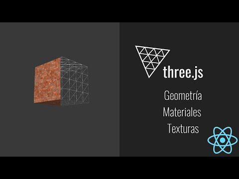

# Conceptos basicos de geometria y materiales de Three.js

Hay muchas propiedades de three.js, puedes explorar muchas mas en esta bonita libreria aqui https://threejs.org/

## Instalacion
No te olvides de ejecutar el comando $npm install cuando descarges el proyecto

## Librerias 
three.js 

